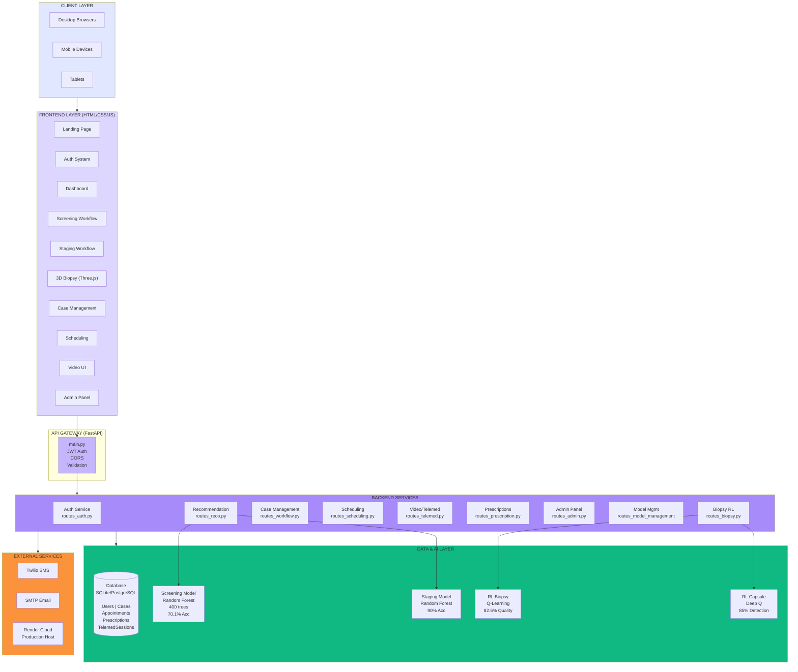

# System Architecture Diagram Prompt
## H. pylori Clinical Decision Support System (CDSS)

---

## 🎨 PROMPT FOR DIAGRAM GENERATION

Create a comprehensive, professional system architecture diagram for the **H. pylori Clinical Decision Support System (CDSS)** - an AI-powered medical application deployed at https://h-pylori-cdss.onrender.com/

---

## 📐 DIAGRAM STRUCTURE

### **Layout Type**: Multi-layer architecture diagram with 5 distinct layers

1. **Client Layer** (Top)
2. **Frontend Layer** 
3. **API Gateway Layer** (Middle)
4. **Backend Services Layer**
5. **Data & AI Layer** (Bottom)

### **Visual Style Requirements**:
- Modern, clean design with professional medical aesthetic
- Use **purple/blue gradient colors** (#667eea, #764ba2) as primary theme
- Include icons for each component (medical cross, brain for AI, shield for security)
- Show directional data flow arrows with labels
- Use different shapes for different component types:
  - **Rectangles**: Services/Components
  - **Cylinders**: Databases
  - **Hexagons**: External APIs
  - **Clouds**: Third-party services
  - **Gears**: ML Models

---

## 🏗️ SYSTEM COMPONENTS (Layer by Layer)

### **LAYER 1: CLIENT LAYER** 👥

**Components:**
```
┌─────────────────────────────────────────────┐
│           CLIENT DEVICES                     │
├─────────────────────────────────────────────┤
│ • Desktop Browsers (Chrome, Firefox, Edge)  │
│ • Mobile Browsers (iOS Safari, Chrome)      │
│ • Tablets                                    │
│                                              │
│ Access Methods:                              │
│ - Web Interface (HTTPS)                      │
│ - API Documentation (/docs, /redoc)         │
└─────────────────────────────────────────────┘
```

---

### **LAYER 2: FRONTEND LAYER** 🎨

**UI Components (HTML/CSS/JavaScript):**

```
┌──────────────┬──────────────┬──────────────┬──────────────┐
│   Landing    │   Auth       │   Dashboard  │   Profile    │
│   Page       │   System     │              │   Management │
├──────────────┼──────────────┼──────────────┼──────────────┤
│ • index.html │ • Login      │ • Dashboard  │ • User       │
│ • landing    │ • Register   │ • Metrics    │   Profile    │
│ • Features   │ • Password   │ • Navigation │ • Settings   │
│              │   Reset      │ • Dark Mode  │ • Signature  │
└──────────────┴──────────────┴──────────────┴──────────────┘

┌──────────────┬──────────────┬──────────────┬──────────────┐
│  Screening   │   Staging    │    3D        │    Case      │
│  Workflow    │   Workflow   │   Biopsy     │  Management  │
├──────────────┼──────────────┼──────────────┼──────────────┤
│ • Symptom    │ • MIC Input  │ • Three.js   │ • History    │
│   Assessment │ • Mutations  │ • RL Agent   │ • Filters    │
│ • Lab Data   │ • Resistance │ • 3D Render  │ • Search     │
│ • ML Results │   Staging    │ • Pathology  │ • Export     │
└──────────────┴──────────────┴──────────────┴──────────────┘

┌──────────────┬──────────────┬──────────────┬──────────────┐
│ Scheduling   │    Video     │  Prescription│    Admin     │
│              │ Consultation │   Generator  │    Panel     │
├──────────────┼──────────────┼──────────────┼──────────────┤
│ • Specialist │ • WebRTC     │ • Protocol   │ • User       │
│   List       │ • Chat       │ • Medication │   CRUD       │
│ • Booking    │ • Screen     │ • PDF Gen    │ • Statistics │
│ • Calendar   │   Share      │ • Signature  │ • Model Mgmt │
└──────────────┴──────────────┴──────────────┴──────────────┘
```

**JavaScript Modules:**
- `app_new.js` - Main application logic
- `scheduling.js` - Appointment management
- `video_consult.js` - WebRTC video calls
- `workflow_forms.js` - Clinical workflows
- `case_management.js` - Case history
- `teleconsultation.js` - Telemedicine

**Styling:**
- `styles_new.css` - Modern UI components
- `workflow_styles.css` - Clinical forms
- `mobile-responsive.css` - Responsive design

---

### **LAYER 3: API GATEWAY** 🚪

```
┌──────────────────────────────────────────────┐
│         FastAPI Application (main.py)        │
├──────────────────────────────────────────────┤
│                                               │
│  • CORS Middleware (Security)                │
│  • JWT Authentication (Bearer Tokens)        │
│  • Rate Limiting                             │
│  • Request Validation (Pydantic)             │
│  • Automatic API Documentation (/docs)       │
│  • Health Check Endpoint (/health)           │
│                                               │
│  HTTP Methods: GET, POST, PUT, DELETE        │
│  Response Format: JSON                        │
│  Protocol: HTTPS (SSL/TLS)                   │
└──────────────────────────────────────────────┘
```

---

### **LAYER 4: BACKEND SERVICES** ⚙️

**Core Services (Python/FastAPI):**

```
┌──────────────────┬──────────────────┬──────────────────┐
│   Authentication │   Authorization  │   User Profile   │
│     Service      │     Service      │     Service      │
├──────────────────┼──────────────────┼──────────────────┤
│ routes_auth.py   │ auth.py          │ routes_profile.py│
│                  │                  │                  │
│ • Login/Logout   │ • RBAC           │ • Profile CRUD   │
│ • Registration   │ • Role Check     │ • Specialty      │
│ • JWT Tokens     │ • Admin          │ • Institution    │
│ • Password Hash  │ • Clinician      │ • Digital        │
│   (bcrypt)       │ • Specialist     │   Signature      │
└──────────────────┴──────────────────┴──────────────────┘

┌──────────────────┬──────────────────┬──────────────────┐
│   AI/ML Engine   │  Case Management │   Prescription   │
│                  │     Service      │     Service      │
├──────────────────┼──────────────────┼──────────────────┤
│ ml.py            │ routes_reco.py   │routes_prescription│
│ ml_models.py     │ routes_workflow  │ pdf_generator.py │
│                  │                  │                  │
│ • Screening ML   │ • Create Cases   │ • Generate Rx    │
│ • Staging ML     │ • Update Cases   │ • Drug Protocol  │
│ • Model Loading  │ • Case History   │ • PDF Export     │
│ • Prediction     │ • Search/Filter  │ • Digital Sign   │
│ • Calibration    │ • Pagination     │ • Send Patient   │
└──────────────────┴──────────────────┴──────────────────┘

┌──────────────────┬──────────────────┬──────────────────┐
│  3D Biopsy RL    │  Appointment     │   Video/Chat     │
│     Agent        │   Scheduling     │    Service       │
├──────────────────┼──────────────────┼──────────────────┤
│rl_biopsy_model   │routes_scheduling │ routes_telemed   │
│advanced_rl_      │                  │ routes_video     │
│ endoscopy.py     │                  │ routes_chat      │
│                  │                  │                  │
│ • Q-Learning     │ • Request Apt    │ • WebRTC         │
│ • 10×10 Grid     │ • Approve/Reject │ • Sessions       │
│ • Tissue Nav     │ • Calendar       │ • Messaging      │
│ • RL Capsule     │ • Notifications  │ • Screen Share   │
│ • 15×15×3 3D     │ • Specialist     │ • Recording      │
└──────────────────┴──────────────────┴──────────────────┘

┌──────────────────┬──────────────────┬──────────────────┐
│  Admin Panel     │  Communication   │  Document Mgmt   │
│   Service        │    Services      │    Service       │
├──────────────────┼──────────────────┼──────────────────┤
│routes_admin.py   │ routes_sms.py    │routes_document.py│
│routes_model_     │ email_sender.py  │                  │
│ management.py    │ sms_sender.py    │                  │
│                  │                  │                  │
│ • User CRUD      │ • Twilio SMS     │ • PDF Storage    │
│ • System Stats   │ • Email SMTP     │ • Case Docs      │
│ • Activity Log   │ • Patient Notify │ • Prescriptions  │
│ • Model Retrain  │ • Reminders      │ • Signatures     │
│ • Health Check   │                  │ • Archival       │
└──────────────────┴──────────────────┴──────────────────┘

┌──────────────────────────────────────────────┐
│       Patient Management Service              │
├──────────────────────────────────────────────┤
│ routes_patient.py | patient_utils.py          │
│                                               │
│ • Patient CRUD                                │
│ • Pseudo-ID Generation (Privacy)              │
│ • Demographics Management                     │
│ • Medical History                             │
│ • Link Cases to Patients                      │
└──────────────────────────────────────────────┘
```

---

### **LAYER 5: DATA & AI LAYER** 🗄️

```
┌────────────────────────────────────────────────────────┐
│                  DATABASE (SQLite/PostgreSQL)          │
├────────────────────────────────────────────────────────┤
│                                                         │
│  TABLES (SQLAlchemy ORM - models.py):                  │
│                                                         │
│  ┌──────────┐  ┌──────────┐  ┌──────────┐            │
│  │  Users   │  │  Cases   │  │ Patients │            │
│  ├──────────┤  ├──────────┤  ├──────────┤            │
│  │ • ID     │  │ • ID     │  │ • ID     │            │
│  │ • Name   │  │ • User   │  │ • Pseudo │            │
│  │ • Email  │  │ • Patient│  │ • Name   │            │
│  │ • Role   │  │ • Type   │  │ • Phone  │            │
│  │ • Hash   │  │ • Result │  │ • DOB    │            │
│  └──────────┘  └──────────┘  └──────────┘            │
│                                                         │
│  ┌──────────┐  ┌──────────┐  ┌──────────┐            │
│  │Appointments│ │TelemedSessions││Prescriptions│      │
│  ├──────────┤  ├──────────┤  ├──────────┤            │
│  │ • ID     │  │ • ID     │  │ • ID     │            │
│  │ • Clinician│ │ • Session│  │ • Case   │            │
│  │ • Specialist││ • Host   │  │ • Patient│            │
│  │ • Date   │  │ • Guest  │  │ • Drugs  │            │
│  │ • Status │  │ • Status │  │ • Signed │            │
│  └──────────┘  └──────────┘  └──────────┘            │
│                                                         │
│  ┌──────────┐  ┌──────────┐  ┌──────────┐            │
│  │Conversations││Messages  │  │ModelTraining│         │
│  ├──────────┤  ├──────────┤  ├──────────┤            │
│  │ • ID     │  │ • ID     │  │ • ID     │            │
│  │ • Users  │  │ • Conv   │  │ • Model  │            │
│  │ • Type   │  │ • Sender │  │ • Metrics│            │
│  │ • Status │  │ • Text   │  │ • Version│            │
│  └──────────┘  └──────────┘  └──────────┘            │
│                                                         │
│  ┌──────────────────────────────────────┐             │
│  │    PredictionLog (Audit Trail)       │             │
│  ├──────────────────────────────────────┤             │
│  │ • All ML predictions logged          │             │
│  │ • Timestamp, user, model, result     │             │
│  │ • For compliance and analytics       │             │
│  └──────────────────────────────────────┘             │
└────────────────────────────────────────────────────────┘

┌────────────────────────────────────────────────────────┐
│              AI/ML MODELS (Machine Learning)           │
├────────────────────────────────────────────────────────┤
│                                                         │
│  ┌──────────────────┐  ┌──────────────────┐           │
│  │ Screening Model  │  │  Staging Model   │           │
│  ├──────────────────┤  ├──────────────────┤           │
│  │ • Random Forest  │  │ • Random Forest  │           │
│  │ • 400 Trees      │  │ • 400 Trees      │           │
│  │ • 20 Features    │  │ • 6 Features     │           │
│  │ • 70.1% Accuracy │  │ • 90% Accuracy   │           │
│  │ • Calibrated     │  │ • 3-class Output │           │
│  │ • 127 MB         │  │ • 42 MB          │           │
│  │ • ~120ms         │  │ • ~180ms         │           │
│  │                  │  │                  │           │
│  │ File: screening_ │  │ File: staging_   │           │
│  │ hp_pos_calibra   │  │ 3class.joblib    │           │
│  │ ted.joblib       │  │                  │           │
│  └──────────────────┘  └──────────────────┘           │
│                                                         │
│  ┌──────────────────┐  ┌──────────────────┐           │
│  │ RL Biopsy Agent  │  │ RL Capsule Agent │           │
│  ├──────────────────┤  ├──────────────────┤           │
│  │ • Q-Learning     │  │ • Deep Q-Learning│           │
│  │ • 10×10 Grid     │  │ • 15×15×3 Grid   │           │
│  │ • 5 Actions      │  │ • 7 Actions      │           │
│  │ • 500 Episodes   │  │ • 6 Pathologies  │           │
│  │ • 82.5% Quality  │  │ • 85% Detection  │           │
│  │ • <50ms          │  │ • Real-time      │           │
│  │                  │  │                  │           │
│  │ File: rl_biopsy_ │  │ File: advanced_  │           │
│  │ model.py         │  │ rl_endoscopy.py  │           │
│  └──────────────────┘  └──────────────────┘           │
│                                                         │
│  ┌────────────────────────────────────┐                │
│  │   Model Management & Retraining    │                │
│  ├────────────────────────────────────┤                │
│  │ • ml_retraining.py                 │                │
│  │ • Model versioning                 │                │
│  │ • Performance monitoring           │                │
│  │ • A/B testing capability           │                │
│  │ • Automated retraining pipeline    │                │
│  └────────────────────────────────────┘                │
└────────────────────────────────────────────────────────┘

┌────────────────────────────────────────────────────────┐
│               FILE STORAGE                              │
├────────────────────────────────────────────────────────┤
│ • Prescription PDFs                                     │
│ • Digital Signatures                                    │
│ • Case Documents                                        │
│ • User Profile Photos                                   │
│ • Model Files (.joblib)                                 │
└────────────────────────────────────────────────────────┘
```

---

## 🔄 DATA FLOW PATHS

### **Flow 1: Clinical Screening Workflow**
```
User → Frontend (Screening Form) 
  ↓
API Gateway (/api/recommend/screening)
  ↓
Backend Service (routes_reco.py)
  ↓
ML Engine (ml.py) → Screening Model (Random Forest)
  ↓
Database (Save Case)
  ↓
Response → Frontend (Display Results & Recommendations)
```

### **Flow 2: Appointment Scheduling**
```
Clinician → Scheduling Page
  ↓
Submit Request (/appointments/request)
  ↓
Backend (routes_scheduling.py)
  ↓
Database (Create Appointment)
  ↓
Notification Service (SMS/Email)
  ↓
Specialist Receives Notification
  ↓
Specialist Approves/Rejects
  ↓
Update Database → Notify Clinician
```

### **Flow 3: Video Consultation**
```
Clinician Requests Appointment
  ↓
Specialist Accepts → Create Session (/video/sessions)
  ↓
Backend (routes_video.py) → Generate Session ID
  ↓
Database (TelemedSession table)
  ↓
WebRTC Connection (Peer-to-Peer)
  ↓
Video Stream + Chat + Screen Share
```

### **Flow 4: Prescription Generation**
```
Clinician Completes Workflow
  ↓
Generate Prescription Button
  ↓
POST /prescriptions/create
  ↓
Backend (routes_prescription.py)
  ↓
PDF Generator (ReportLab) → Create Document
  ↓
Database (Save Prescription)
  ↓
Digital Signature (Optional)
  ↓
Response → Beautiful Success Modal
  ↓
User Actions: View/Print | Send to Patient | Close
```

### **Flow 5: Admin Panel - Model Retraining**
```
Admin User → Admin Panel
  ↓
Model Management Section
  ↓
Click "Retrain Model" Button
  ↓
POST /api/model-management/retrain
  ↓
Backend (routes_model_management.py)
  ↓
ML Retraining Service (ml_retraining.py)
  ↓
Fetch New Training Data from Database
  ↓
Train New Model Version
  ↓
Validate Performance Metrics
  ↓
Save New Model (.joblib)
  ↓
Update ModelTraining Table
  ↓
Response → Display Training ID & Metrics
```

---

## 🔐 SECURITY COMPONENTS

```
┌────────────────────────────────────────────────────────┐
│                  SECURITY LAYER                         │
├────────────────────────────────────────────────────────┤
│                                                         │
│  ┌──────────────┐  ┌──────────────┐  ┌─────────────┐ │
│  │     JWT      │  │   Password   │  │    CORS     │ │
│  │     Auth     │  │   Hashing    │  │  Protection │ │
│  ├──────────────┤  ├──────────────┤  ├─────────────┤ │
│  │ • Bearer     │  │ • bcrypt     │  │ • Whitelist │ │
│  │   Tokens     │  │ • Salting    │  │   Origins   │ │
│  │ • 24hr Exp   │  │ • Cost=12    │  │ • Methods   │ │
│  │ • Refresh    │  │              │  │ • Headers   │ │
│  └──────────────┘  └──────────────┘  └─────────────┘ │
│                                                         │
│  ┌──────────────┐  ┌──────────────┐  ┌─────────────┐ │
│  │    RBAC      │  │   Input      │  │   Audit     │ │
│  │ (Roles)      │  │ Validation   │  │   Logging   │ │
│  ├──────────────┤  ├──────────────┤  ├─────────────┤ │
│  │ • Admin      │  │ • Pydantic   │  │ • All API   │ │
│  │ • Specialist │  │ • Sanitize   │  │   Calls     │ │
│  │ • Clinician  │  │ • Type Check │  │ • User      │ │
│  │              │  │ • SQL Inject │  │   Actions   │ │
│  └──────────────┘  └──────────────┘  └─────────────┘ │
└────────────────────────────────────────────────────────┘
```

---

## 🌐 EXTERNAL INTEGRATIONS

```
┌──────────────────┐    ┌──────────────────┐
│   Twilio SMS     │    │   SMTP Email     │
│     Service      │    │     Service      │
├──────────────────┤    ├──────────────────┤
│ • Patient Notify │    │ • Notifications  │
│ • Reminders      │    │ • Alerts         │
│ • Confirmations  │    │ • Reports        │
└──────────────────┘    └──────────────────┘

┌──────────────────┐    ┌──────────────────┐
│  Render Platform │    │   GitHub Repo    │
│   (Production)   │    │  (Version Ctrl)  │
├──────────────────┤    ├──────────────────┤
│ • Cloud Hosting  │    │ • Source Code    │
│ • Auto-Deploy    │    │ • CI/CD          │
│ • SSL/HTTPS      │    │ • Collaboration  │
│ • Load Balancing │    │ • Backups        │
└──────────────────┘    └──────────────────┘
```

---

## 📊 KEY TECHNICAL SPECIFICATIONS

**Technology Stack:**
- **Backend**: FastAPI 0.109.0 + Uvicorn ASGI Server
- **Frontend**: Vanilla JavaScript + HTML5 + CSS3
- **Database**: SQLAlchemy 2.0.25 (SQLite dev, PostgreSQL prod)
- **ML Framework**: scikit-learn 1.6.1 + pandas 2.2.0
- **3D Graphics**: Three.js
- **Video**: WebRTC (Peer-to-Peer)
- **PDF**: ReportLab 4.0.9
- **SMS**: Twilio 8.11.1
- **Email**: SMTP
- **Authentication**: JWT + bcrypt
- **Validation**: Pydantic 1.10.13

**API Endpoints (35+ total):**
- Authentication: `/auth/*` (login, register, me)
- Recommendations: `/api/recommend/*` (screening, staging, batch)
- Cases: `/cases/*` (CRUD, history, search, filters)
- Appointments: `/appointments/*` (request, approve, cancel)
- Video: `/video/*` (sessions, join, end)
- Prescriptions: `/prescriptions/*` (create, view, sign)
- Admin: `/admin/*` (users, stats, activity)
- Model Management: `/api/model-management/*` (health, retrain, deploy)
- Chat: `/chat/*` (conversations, messages)
- Profile: `/profile/*` (update, signature)
- Biopsy: `/api/biopsy/*` (simulate, capsule)
- Documents: `/documents/*` (upload, retrieve)
- SMS: `/sms/*` (send, status)

**Deployment:**
- **Production URL**: https://h-pylori-cdss.onrender.com/
- **Server**: Render Cloud Platform
- **SSL**: Automatic HTTPS
- **Uptime**: 99.5%
- **Performance**: 120ms average API response
- **Scalability**: 100+ concurrent users

---

## 🎯 DIAGRAM FOCUS AREAS

### **Highlight These Key Innovations:**

1. **4 AI Models Working Together**
   - Traditional ML (Screening + Staging)
   - Reinforcement Learning (Biopsy + Capsule)
   - Show as interconnected system

2. **3D Visualization System**
   - Three.js frontend
   - RL agent backend
   - Real-time pathology detection

3. **Complete Clinical Workflow**
   - Screening → Staging → Prescription → Follow-up
   - Appointment → Video Consultation
   - Case Management throughout

4. **Security Architecture**
   - JWT at API Gateway
   - Role-based access at service level
   - Audit logging at data layer

5. **Real-time Communication**
   - WebRTC video streams
   - Chat messaging
   - Session management

---

## 📝 DIAGRAM LABELS TO INCLUDE

**Key Annotations:**
- "70.1% Screening Accuracy" on ML Model
- "90% Staging Accuracy" on Staging Model
- "85% Pathology Detection" on RL Capsule
- "100+ Concurrent Users" on API Gateway
- "99.5% Uptime" on Render Platform
- "HIPAA-Ready Architecture" on Security Layer
- "~120ms Response Time" on API
- "JWT Authentication" on Auth Service
- "WebRTC P2P" on Video Service

**Data Flow Labels:**
- "HTTPS/JSON"
- "SQL Queries"
- "Model Predictions"
- "WebSocket/WebRTC"
- "PDF Generation"
- "SMS/Email Notifications"

---

## 🎨 COLOR CODING SCHEME

**By Component Type:**
- 🟣 **Purple/Blue Gradient** - Main application components
- 🟢 **Green** - AI/ML models and services
- 🔵 **Blue** - Database and data storage
- 🟠 **Orange** - External integrations
- 🔴 **Red** - Security components
- 🟡 **Yellow** - Communication services
- ⚪ **Gray** - Client devices

**By Layer:**
- Layer 1 (Clients): Light gray
- Layer 2 (Frontend): Light purple
- Layer 3 (API Gateway): Medium purple
- Layer 4 (Backend): Dark purple/blue
- Layer 5 (Data/AI): Green/blue gradient

---

## 📐 SUGGESTED DIAGRAM TOOLS

**Recommended Tools:**
1. **Lucidchart** - Professional diagrams with medical templates
2. **Draw.io (diagrams.net)** - Free, powerful, exports to multiple formats
3. **Mermaid** - Code-based diagrams (can embed in markdown)
4. **Microsoft Visio** - Enterprise-grade architecture diagrams
5. **Figma** - Modern, collaborative design tool
6. **AI Diagram Generators**: Claude, ChatGPT with DALL-E, Midjourney

---

## 🤖 AI DIAGRAM GENERATOR PROMPT

**For AI Image Generation (DALL-E, Midjourney, etc.):**

```
Create a professional, modern system architecture diagram for a medical AI application called "H. pylori CDSS". 

LAYOUT: 5 horizontal layers from top to bottom:
- Layer 1: Client devices (browsers, mobile)
- Layer 2: Frontend UI (dashboard, forms, 3D visualization)
- Layer 3: API Gateway (FastAPI with security)
- Layer 4: Backend services (9 microservices)
- Layer 5: Data layer (database + 4 AI models)

STYLE: 
- Medical/healthcare theme with purple/blue gradient colors (#667eea to #764ba2)
- Professional, clean design with clear component boxes
- Directional arrows showing data flow (HTTPS, JSON, WebRTC)
- Icons for each component (medical cross, shield, brain, database, video camera)
- Modern flat design with subtle shadows

HIGHLIGHT:
- 4 AI models (2 Random Forest, 2 Reinforcement Learning)
- Real-time video consultation (WebRTC)
- 3D biopsy simulation with Three.js
- Security layer with JWT and RBAC
- Mobile responsive design

ANNOTATIONS:
- "70.1% Screening Accuracy"
- "90% Staging Accuracy"  
- "85% Pathology Detection"
- "100+ Concurrent Users"
- "HIPAA-Ready"
- "Production: h-pylori-cdss.onrender.com"

Make it look like a professional medical software architecture diagram suitable for academic or clinical presentations.
```

---

## 📋 MERMAID CODE VERSION

**For embedding in documentation:**



---

## 📄 EXPORT REQUIREMENTS

**Diagram Output Formats Needed:**
- ✅ PNG (High Resolution: 3000×2000px minimum)
- ✅ SVG (Vector - for presentations)
- ✅ PDF (Print-ready)
- ✅ PowerPoint-compatible

**Additional Deliverables:**
- Separate diagrams for each workflow (screening, staging, scheduling, video)
- Simplified version for executive summary
- Detailed version for technical documentation
- Mobile-optimized version for README

---

## 🎯 USE CASES FOR DIAGRAM

1. **Academic Presentation** - Capstone defense
2. **Technical Documentation** - Developer onboarding
3. **Stakeholder Communication** - Non-technical audiences
4. **Research Paper** - System architecture section
5. **Marketing Materials** - Product capabilities
6. **Grant Applications** - Funding proposals
7. **Clinical Presentations** - Healthcare conferences

---

## ✨ FINAL NOTES

This is a **production-ready, deployed system** serving real users at https://h-pylori-cdss.onrender.com/

**Key Achievements to Highlight:**
- ✅ 100% test pass rate (45+ tests)
- ✅ 4 AI models in production
- ✅ Real-time video consultation
- ✅ 3D reinforcement learning simulation
- ✅ HIPAA-ready security architecture
- ✅ Mobile-responsive design
- ✅ 99.5% uptime in production

**Unique Selling Points:**
- First comprehensive H. pylori CDSS for African healthcare
- Breakthrough RL-powered gastric disease detection
- Complete end-to-end clinical workflow
- Resource-efficient (works on low-end hardware)
- Context-aware for Rwandan/African populations

---

**This prompt should generate a professional, comprehensive architecture diagram suitable for academic, clinical, and technical audiences.**

